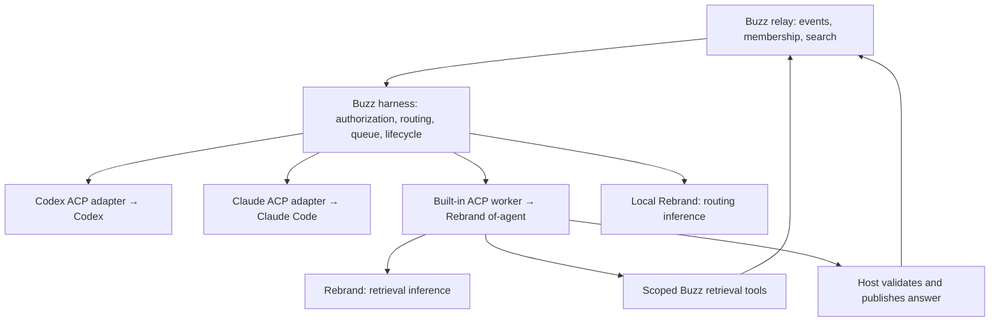

# Rebrand, agent runtimes, and message routing

Analysis and proposed implementation plan, 2026-09-18.

Source baseline: Buzz `beeb1408f` and the neighboring Rebrand checkout at
`233ff18`; both worktrees were clean when inspected. Rebrand is at
`/home/lth/dev/rebrand`. This is a design proposal, not an implementation or a
claim of runtime compatibility. Prior research and the proof README were used
as leads, then checked against these source trees. No fleet configuration was
changed and no GPU workload was started.

**Recommendation:** make Rebrand the implementation of Buzz's built-in
inference and retrieval agents. Keep Codex and Claude Code as the two supported
external coding runtimes. Preserve Buzz's identity, event, permission,
subscription, lifecycle, and activity machinery. Turn the existing relevance
gate into an explicit, explainable admission policy with local inference.

The important simplification is ownership: Buzz decides who may act and where;
Rebrand serves models and executes the built-in retrieval loop; Codex and Claude
own their coding loops. Avoid maintaining a second general-purpose model SDK
and coding loop inside Buzz.

**Confirmed scope:** Rebrand handles Buzz’s built-in inference: routing,
retrieval, and eventually voice. Codex and Claude retain their native model
connections. “Codex and Claude only” refers to supported external agent runtimes;
local models power the built-in features. Confirmed by the user on 2026-09-18.

## 1. Where model compute enters Buzz today

| Surface | Current evidence | Proposed disposition |
|---|---|---|
| Agent lifecycle and relay ingress | `crates/buzz-acp/src/{lib,acp,pool,queue,scope,relay}.rs`: subscriptions, author checks, sessions, subprocesses, cancellation, presence, typing, observer events | Keep. This is valuable Buzz integration, independent of who serves the model. |
| Built-in general agent | `crates/buzz-agent/src/{agent,llm,config,handoff,mcp}.rs`: its own loop, context handling, MCP execution, provider parsing | Replace its shipped role with the Rebrand retrieval runtime. Retire the duplicate loop after parity and migration. |
| Direct provider adapters | `buzz-agent/src/config.rs::Provider` and `llm.rs`: Anthropic, OpenAI, OpenRouter, Databricks, Databricks V2; Chat Completions, Responses, Messages shapes; OAuth and model capability tables | Remove from the supported Buzz product as the old runtime is retired. Put built-in inference compatibility in Rebrand. Calling an Anthropic model here is distinct from running Claude Code. |
| Semantic admission | `buzz-acp/src/relevance.rs`, `filter.rs`, `lib.rs`: optional per-rule local-compatible HTTP classifier | Evolve in place. It already sits after cheaper checks, but needs a stronger behavioral and failure contract. |
| Runtime discovery and setup | `desktop/src-tauri/src/managed_agents/discovery/{catalog,presets,runtime_metadata}.rs`; readiness, config bridges, environment assembly | Ship Codex, Claude, Built-in. Remove Goose and the Pi/Devin/Cursor/OMP/Grok/OpenCode/Kimi/Amp/Hermes/OpenClaw preset/install paths from the supported build. |
| Agent definitions and UI | `crates/buzz-persona`; desktop managed agents, defaults, teams, model discovery and config field model | Keep identity, purpose, access and run location; simplify runtime and inference choices. Add one typed routing policy reused by UI, CLI and headless config. |
| Shared GPU compute | Optional desktop `mesh-llm` feature, `desktop/src-tauri/src/mesh_llm`, `managed_agents/relay_mesh.rs`, relay mesh admission and integration tests | Replace model execution with Rebrand deliberately. Existing membership/discovery/revocation behavior is a separate requirement from local model serving. |
| Voice inference | `crates/buzz-voice` uses ONNX Runtime and sherpa-onnx; desktop huddle STT uses Parakeet, TTS uses Pocket, with model/voice lifecycle management | Include in the compute roadmap. Rebrand has whisper/tts crates, but that does not prove feature or performance parity. Migrate after text, or explicitly retain voice as a named exception. |
| Process packaging and remote launch | `crates/sprig`, `buzz-backend-kubernetes`, desktop backend/spawn configuration | Keep launch and identity semantics. Replace bundled general-agent payload with the built-in Rebrand worker; pin matching artifacts. |
| Retrieval | `buzz-search` is Postgres FTS; CLI message search/thread reads and relay `/query` already exist | Reuse. There is no need to introduce embeddings or a vector database to make the first retrieval agent useful. |
| Workflows | `buzz-workflow/src/schema.rs::ActionDef` has messages, reactions, webhooks, approvals and delays | No direct LLM action in this enum. Workflows can address agents through existing events; avoid another model-calling loop here. |
| Web/mobile | Source search found no direct text-model provider client in `web/src` or `mobile/lib`; mobile consumes agent activity and records voice notes | Consume the same agents and policy state. Recording/playback is not itself inference. Native voice/platform code needs a separate parity audit during the voice migration. |

“Remove support” must cover discovery, defaults, templates, readiness, credential
fields, spawn configuration, packaging and tests—not merely hiding a dropdown.
Substrate providers such as Kubernetes/Blox are a different concept from model
providers and are not removed by the Codex/Claude restriction.

## 2. Rebrand has two useful integration levels

**Inference is already a plausible wire fit.** The existing
`scripts/rebrand-proof` drives Buzz → ACP → `buzz-agent` → Chat Completions → a
backend, then replies through a shell tool. Its README reports a passing strict
stub test, not a successful live Rebrand retrieval test. The first reported
request was about 25K characters, already unsuitable for a 4K context setting.
Do not turn that large coding-seat prompt into the retrieval default.

**The agentic loop requires a real replacement.** Rebrand's
`crates/of-agent` exposes `Agent`, caller-owned serializable `AgentState`,
`ToolProvider`, `ToolPolicy`, `ContextStrategy`, `TerminationPolicy`, observers,
and iteration/token/time/tool budgets. `of::ToolResponse` supports
`KnowledgeChunk` and `Source`. These are directly useful for retrieval. Merely
pointing `buzz-agent` at Rebrand leaves Buzz's own loop in charge and does not
satisfy the deep-integration requirement.

Recommended deployment:



Build a thin ACP front end around `of-agent`, preferably packaged from the
Rebrand side. Buzz already supervises ACP children, so this preserves session
and cancellation seams without teaching the main relay to run GPU workloads.
The adapter owns protocol translation; Rebrand owns iteration, tool dispatch,
context handling and termination. Never nest Rebrand's loop inside the existing
Buzz loop. “Built-in” means installed, configured and observable with Buzz, and
usable without installing a coding CLI; it need not mean inside the relay
process or even inside the desktop process.

A future in-process worker could remove IPC overhead if measurement warrants
it. Start with the existing process boundary: it avoids coupling native model
dependencies and Rebrand release cadence to the desktop/relay binary.
Rebrand's crates currently publish to the private `aitaco` registry and its
repository has a proprietary license. Package the worker separately for the
owned distribution; do not silently make the OSS Cargo workspace depend on
private source. Establish the distribution arrangement before changing those
manifests. This is a concrete packaging dependency, not a reason to defer design.

**Compatibility work that must precede rollout:**

- Use the inspected single-model serving path initially. It carries tool
  definitions and parses calls. In `ml/ollama_routes.rs::chat_completions_multi`,
  messages become plain text and non-system/assistant roles become user; that
  conversion loses tool-result semantics. Multi-model serving needs parity
  before being used for retrieval, regardless of matching endpoint names.
- `ml/api_types.rs` rejects unknown top-level request fields. It accepts
  `response_format` and tool fields, but not `reasoning_effort`. Rebrand's `of`
  provider constructs its own request, so audit that path separately from the
  existing Buzz proof. Its base URL appends `/v1/chat/completions`; Buzz's
  adapter appends `/chat/completions`. Avoid a doubled `/v1`.
- Buzz already checks a choice-level `finish_reason: "error"` in
  `buzz-agent/src/llm.rs`. The earlier research calling this an unfixed Buzz
  gap is obsolete. Rebrand's inspected `of` OpenAI stream parser handles
  explicit error objects but its finish-reason default maps unknown values to
  normal completion/tool use. Add an explicit failure case there and cover
  Rebrand's own error-stream shape before replacing the Buzz parser.
- `of-agent::Budget` checks limits between model calls. Wrap provider and tool
  calls in real deadlines, bound queued work and response bytes, reserve
  remaining tokens before calls, and account for optional final answer
  shaping. Do not treat a loop budget as cancellation of a hung HTTP request.
- Map explicit success, failure, refusal, exhaustion, cancellation, and implicit
  completion deliberately. An answer string alone is not proof of success.
- Pin Rebrand binary, model, tokenizer/template, quantization and serving
  configuration. Verify cancellation releases work on the server as well as
  the client. Actual throughput, memory and quality remain unmeasured here.

## 3. A built-in retrieval agent

The initial product should answer questions such as “What happened last time
we saw this error?”, find decisions, summarize a thread and point to source
messages. A user chooses a purpose and channels; Buzz supplies the runtime.

Give the loop a small semantic tool set: search messages, read a thread, read a
permitted document/canvas, and finish with an answer plus source references.
Start with message search and thread reading; add other readers through the
same policy boundary. Reuse existing CLI semantics and typed SDK primitives.
Expose operator configuration and diagnostics in `buzz-cli` first. Implement
tool handlers with typed calls to existing query/event surfaces, not a shell
that constructs arbitrary CLI commands.

The retrieval runtime gets no shell, file editor, arbitrary URL fetch,
membership administration, generic signing, or unrestricted message-post tool.
The host publishes the final validated answer once, as the agent, in the
triggering thread. That is simpler to operate and easier for small models than
asking them to navigate the full developer tool surface.

The built-in launch must also suppress inherited Buzz signing credentials and
the default developer MCP server; hiding tools in a prompt is insufficient.
Give the worker only its scoped tool connection and inference configuration.
Keep the signer in the host. This is a deliberately narrower launch profile
than today's coding agents, not a claim that existing ACP launch is keyless.
Readers use explicit Nostr kinds and `h` channel filters, derive the actual
thread root, and preserve reply counters through the existing publication path.

`buzz-sdk/src/broker` is an existing **contract only** for semantic operations
and idempotent requests; it is not an implemented authorization host. Reuse its
request identity and available channel/read/reply concepts where they fit.
Search and other missing operations need concrete typed extensions and host
implementation. Do not claim the broker already makes this safe. A local
restricted tool adapter can implement the required subset without adding a
new public relay endpoint.

Authorization must constrain the information used to compose the answer, not
just the act of posting it. Default to the triggering conversation. Cross-channel
search is permitted only for sources whose audience can receive the resulting
answer, with requester and agent permissions checked as well. Re-check membership
before publication. An agent that belongs to both a private acquisition channel
and a public channel must not summarize the former into the latter. Follow the
direction in `docs/practical-information-flow-for-buzz-agents.md`; audience-bound
history and memory are necessary even when one bot has many memberships.

Use `KnowledgeChunk`/`Source` to preserve event IDs, channel IDs and source
locations through the loop. Check returned citations against fetched sources;
do not let the model invent links. The test suite must also assess whether the
citations support the answer—existing IDs alone do not establish grounding.
No useful evidence should produce an honest “I couldn't find that” response
to a direct question, or silence for an ambient event that needs no response.

Use fresh bounded state per request initially, with explicitly retrieved thread
context for follow-ups. This avoids importing months of coding-agent memory.
For recovery, journal the trigger, configuration generation, run status and
prepared output. Persist the exact signed reply before sending; retry that
event after an ambiguous acknowledgement instead of signing a new reply. Reuse
Rebrand's state serialization only when resuming a loop is actually needed;
do not also adopt a second authoritative conversation store.

## 4. Make routing a product contract

Separate three decisions: **may this agent see/act on this event**, **does it
need to respond**, and **which runtime executes it**. Local inference answers
the middle question. Authorization and runtime choice remain deterministic.

The existing gate is a useful prototype, with concrete limitations:

- It receives message text and the first 1,200 characters of a system prompt,
  not structured purpose, participants, mention identities or thread context.
  It truncates the message at 2,000 characters and has hardcoded judgments
  about what a researcher or generalist should ignore.
- Its default error behavior is wake; timeout is eight seconds. Source comments
  report serialized team requests and timeout-driven wakes. Those are historical
  measurements, not latency guarantees for the current build.
- Cache identity is model, rule name and text, without conversation context or
  policy generation. Missing system prompt disables the gate. A configured gate
  should never silently become unrestricted admission.
- A matching mention rule can still run the classifier if relevance is set:
  the current implementation does not inherently bypass inference on mentions.
- The classifier is awaited from the main ingress branch before queue admission.
  Slow inference can delay other event handling. The decision API collapses
  decline and inference failure into a boolean; the outer turn log reports a
  generic no-rule match.
- The relay can filter `#p` before the harness receives an event. Ambient
  understanding cannot work if the subscription only delivers mentions.

**Recommended first-class policy:**

| Input | Default action after authorization |
|---|---|
| Owner lifecycle control | Existing deterministic control path; never wait for classification. |
| Explicit mention or direct request to this agent | Admit directly, subject to rate/budget limits. Local classifier failure cannot suppress it. |
| Message explicitly addressed to another agent | Ignore unless this agent was also explicitly included. |
| Human follow-up in an active agent thread | Local inference with bounded recent context and thread ownership; acknowledgements need not start a turn. |
| Unaddressed message in an opted-in channel | Classify against the agent's short routing purpose; respond only for a clear useful task. |
| General chatter, quoted mentions, log text | Usually ignore; real event metadata takes precedence over names inside text. |
| Agent-authored message | Ignore ambiently by default; explicit allowed handoffs use bounded hop/turn policy. Existing same-owner author permission is not a reason to start a loop. |
| “Everyone, report status” | Preserve explicit team intent. A configured team/broadcast rule can admit all eligible agents with a fan-out bound. |
| Ambiguous ambient message | Abstain. A configured default responder may clarify; do not wake every specialist. |

Use `act | ignore | abstain` plus a small reason code. Treat parse errors,
timeouts and endpoint overload as operational failures distinct from abstention.
Validate the entire structured response; no invented identities or tool calls
can turn a classifier output into authority. Do not use self-reported model
confidence as a calibrated probability.

**Minimal configuration.** Extend the existing agent definition/rules rather
than creating a routing DSL or a separate agent roster:

```toml
# Proposed schema, not currently accepted configuration.
runtime = "builtin" # alternatively "codex" or "claude"
purpose = "Find prior incidents, decisions, and runbooks; answer with sources."

[routing]
mode = "when_relevant" # "mentioned" or "following" are quieter alternatives
channels = ["<channel-uuid>"]
respond_when = "Someone asks about previous incidents or operational procedures."
ignore_when = "An acknowledgement, casual conversation, or a request to change code."
```

The existing author/access policy remains separate and authoritative. Purpose
is the default routing description; `respond_when` and `ignore_when` are
optional refinements, with examples generated for user review rather than
silently inferred on every request. Endpoint, classifier model, deadlines and
resource limits belong in one operator inference profile, not every persona.
Suggested UI: “Only when mentioned”, “Follow conversations I join”, “When I can
help in selected channels”; a preview shows the decision and why.

**Keep per-agent decisions initially.** This reuses the actual gate and preserves
independent specialists and team broadcasts. Consolidate local inference
scheduling so concurrent harnesses cannot overload the shared model. This may
live in Rebrand's serving admission; a process-local semaphore in each harness
does not bound fleet-wide load. Bound candidates, queue depth, batch size and
per-community rate. Batching reduces overhead only when the serving engine
supports it; it is not evidence that N semantic decisions cost one decision.

For one-answer behavior, default to one ambient responder per channel; other
agents answer mentions and their active conversations. Multiple ambient agents
are an explicit opt-in and may overlap. Do not advertise globally unique
selection from independent yes/no gates. If automatic selection among many
specialists becomes a requirement, add one channel-scoped routing authority
that evaluates a bounded set of existing agent definitions and chooses zero,
one or explicitly several. It needs authenticated dispatch, durable claims and
failover; that is a separate feature, not a hidden implication of this plan.
The initial default makes robust “should I answer?” useful without inventing
that distributed coordinator.

**Failure and lifecycle behavior:**

1. Move inference to a bounded worker queue. Keep event ingestion, controls and
   presence responsive; reserve service capacity for routing versus long
   retrieval requests. Prefer one warmed model with priority scheduling on
   limited hardware; separate model instances only after memory/load tests.
2. Journal pending decisions before acknowledging them internally. Classifier
   failure never wakes all ambient agents. Retry with capped backoff and TTL,
   then record an explicit expired/unavailable terminal state. Show degraded
   routing in diagnostics; direct mentions remain the recovery path.
3. Key decisions by community, agent, event ID, policy revision, model/prompt
   revision and context generation. Fence completions against membership,
   session and config changes. Clear caches on community switches.
4. Overlap backfill and live subscriptions, deduplicate by event ID, and resume
   from a durable cursor. Replays must not repeat completed turns. An edit,
   removal or newer thread message can invalidate a pending decision; define
   and test that behavior rather than replaying stale context.
5. Record admitted/ignored/abstained/failed/expired separately, with trigger ID,
   rule, reason, latency, queue time, model revision and eventual turn ID.
   Keep private text out of general diagnostics. Reuse observer/turn-log
   presentation; explain “why did/didn't it answer?” without dumping prompts.

“Local” means inference on the agent/routing host by default. Community hardware
is a separately enabled trust choice, not synonymous with device-local. Never
silently send classification content to a cloud provider when local compute is
down. Remote agents can use a configured community Rebrand service under that
explicit policy; the desktop must not be their availability dependency.

## 5. Simplify the supported product without losing state

Ship three choices: **Built-in**, **Codex**, **Claude Code**. Keep runtime
capabilities canonical in the Rust catalog and project them through the
existing frontend config model, as the package AGENTS.md requires. Built-in
needs purpose, permitted sources and routing—not provider credentials, shell
settings and coding effort controls.

Introduce a versioned migration for saved agents, persona packs, team defaults,
machine defaults, imported definitions and remote launch payloads. Preserve
unsupported definitions visibly as “runtime no longer supported”; do not
silently convert Goose/Pi/custom agents into Claude or inherit incompatible
environment variables. Allow users to select a supported runtime and save one
atomic validated snapshot. Remove unsupported installers and auto-discovery
from the supported product. Generic ACP transport code can remain internal
because all three supported choices use it; a generic wire implementation does
not require a generic-runtime product UI.

After migration, delete unreachable provider/auth/config branches and update
Sprig, containers, installers, default personas, examples and testing docs.
Keeping upstream source outside the shipped build can ease fork maintenance,
but it must not retain an alternative active configuration matrix. Do not
delete relay, mobile or desktop simply to reduce the repository's line count.

The remaining compute migrations are explicit:

- **Mesh:** Rebrand serving must replace `mesh-llm` execution only after deciding
  how discovery, membership admission, revocation and transport are preserved.
  A single local Rebrand server is not a replacement for multi-host sharding.
  For the first shipped distribution, offer local/configured Rebrand and retire
  the old mesh model-provider option. Restore community pooling on Rebrand only
  once its trust and serving contract is proven. This intentionally defers the
  broader `VISION_MESH.md` promise; update that vision/status instead of claiming
  feature equivalence.
- **Voice:** Rebrand STT/TTS migration must match interruption, incremental
  playback, voice selection/imports, recording isolation, cancellation,
  memory and platform behavior. Keep existing voice until that gate passes;
  a “all built-in inference is Rebrand” milestone is not complete while it
  remains. Voice need not block delivering text routing and retrieval.
- **Search:** retain FTS. Add Rebrand embeddings/reranking only if retrieval
  evaluation identifies a concrete recall/ranking gap, with the same audience
  filters before results enter model context.

## 6. Native Codex and Claude connections

Codex and Claude retain their own model connections, authentication and coding
loops. Buzz integrates their pinned ACP adapters for session control, tools and
activity reporting. Rebrand provides local routing decisions before a coding
agent is invoked, and runs built-in retrieval independently.

This establishes separate configuration ownership: Rebrand endpoint/model
settings apply to built-in inference; external coding runtime settings remain
with Codex and Claude. Do not propagate Rebrand endpoint overrides or credentials
into those runtimes. A Rebrand outage degrades semantic routing and retrieval;
authorized direct mentions can still reach an available Codex or Claude runtime.

Acceptance tests must verify this separation, including native authentication,
model requests, explicit addressing during a Rebrand outage, and absence of
cross-runtime credential or endpoint leakage. Rebrand gateway compatibility for
Codex/Claude is outside the selected implementation scope.

## 7. Implementation sequence and acceptance gates

| Stage | Concrete changes | Evidence required to advance |
|---|---|---|
| 0. Pin the contract | Record supported runtimes, Rebrand artifact/model/serving mode, local-vs-community policy and endpoint contract; inventory persisted configs; select routing/retrieval examples | Reproducible request captures; explicit legacy migration mapping; no unresolved assumption hidden as capability. |
| 1. Prove Rebrand inference | Adapt the existing proof to built-from-source binaries and a real Rebrand endpoint; fix Rebrand error semantics; exercise structured decisions and multi-round tools | Real model passes tool round-trip, JSON decision, cancellation, timeout, truncation, capacity and error tests. Record prompt tokens, memory and warm/cold latency. Stub pass alone is insufficient. |
| 2. Ship built-in retrieval | Thin ACP/Rebrand worker; bounded read tools and host publication; source provenance; per-request state; journal/outbox; installer/headless launch | A fresh user creates a retrieval agent without coding CLI or shell tools. Mention → search → thread read → cited reply works on an isolated live relay. Empty, forbidden, failed and cancelled cases are distinguishable. |
| 3. Promote routing | Typed policy and CLI; nonblocking admission; bounded shared inference scheduling; deterministic explicit addressing; retry journal and diagnostics; UI projection | Shadow evaluation followed by one channel canary. No ambient wakes during classifier outage, no loss of explicit addressing, no duplicate reply on restart, and responsive controls under inference saturation. |
| 4. Reduce runtime matrix | Codex/Claude/Built-in catalog, migrations, defaults, presets, readiness and build cleanup; retire old Buzz loop once replaced | Saved/imported/remote definitions migrate honestly; real Codex and Claude smoke sessions work; community switching and all relevant config surfaces agree. |
| 5. Consolidate remaining compute | Replace or explicitly sunset Mesh execution; migrate voice with platform parity | No advertised unsupported runtime or active duplicate built-in provider path; trust/revocation and voice workflow tests pass. Remaining exceptions are visible until removed. |

Stages 2 and 3 can be developed independently after the inference contract is
known; rollout starts with explicit mentions, then following threads, then
opted-in ambient responses. Each release must be useful on its own, while the
final acceptance still includes the full simplification and compute inventory.

Proposed initial routing evaluation: at least 200 labeled examples covering
direct mentions, implicit follow-ups, acknowledgements, overlapping specialties,
broadcasts, agent messages, quoted instructions, ambiguous pronouns and private
channels. Hold out examples during prompt tuning. Gate on ≥95% precision for
ambient wakes and ≥90% recall for clearly relevant ambient tasks; these are
proposed product thresholds, not measured results. Explicit authorized mentions
must bypass classification in every protocol test. Evaluate per category and
report uncertainty rather than hiding poor categories in an average.

Measure routing p50/p95, queue delay, tokens/event, false wakes, missed requests,
retrieval answer quality, citation support, end-to-end latency and memory under
the expected simultaneous-agent workload. Target a warm routing p95 under one
second on the selected hardware, then accept or revise that target using real
measurements. Do not choose a model solely because its name or size sounds
appropriate. Test routing while retrieval occupies the GPU.

Regression tests must enter the production admission/tool/publication paths.
Include malicious source instructions, forbidden cross-channel retrieval,
membership revocation mid-run, context overflow, malformed JSON, unknown tools,
HTTP-200 error payloads, dropped streams, restart after publication before ACK,
duplicate triggers, stale policy completions, two communities, and unavailable
inference. Removing the relevant guard must fail a test. Rebrand adapter tests
must use the actual serving contract, including SSE, not only a compatible stub.

Follow repository gates for implementation PRs: `just ci`; add `just test`
when relay/db/auth changes are involved. Use live relay workflows for integration
claims, real pinned Codex/Claude adapters for runtime claims, and desktop E2E
for configuration, diagnostics and accessible recovery controls. Native voice
and packaging changes require their platform checks. No implementation tests
were run for this analysis-only document.

## 8. Product alignment and decisions still needing validation

This advances the opening incident-retrieval example in `VISION.md` and its
quiet-by-default behavior. Keeping inference on a managed agent host preserves
the relay-as-workspace architecture. The remote launch remains one-way and the
relay remains the control plane, consistent with `VISION_REMOTE_AGENTS.md`.
Explainable routing and structured tool outcomes serve `VISION_ACTIVITY.md`.

It intentionally changes `VISION_AGENT.md`: Buzz no longer maintains its own
general coding loop/provider stack. It narrows the immediately shipped Mesh
promise as described above. Both documents should change with implementation,
not drift silently from the product. Community isolation and audience-bound
retrieval remain required throughout.

Before selecting production defaults, validate the Rebrand model/hardware
combination, concurrency/cancellation behavior, private worker packaging, and
the exact adapters to ship. The inference ownership decision is settled:
Rebrand powers built-in features, while Codex and Claude keep native connections.
The remaining validation does not require a new agent framework or routing language.

The first concrete implementation slice is a built-in agent that answers a
mention using two read tools and source citations, followed by local routing
in shadow mode. Its success must demonstrate Rebrand's actual loop and serving
engine, not just the older Buzz loop pointed at a stub.
